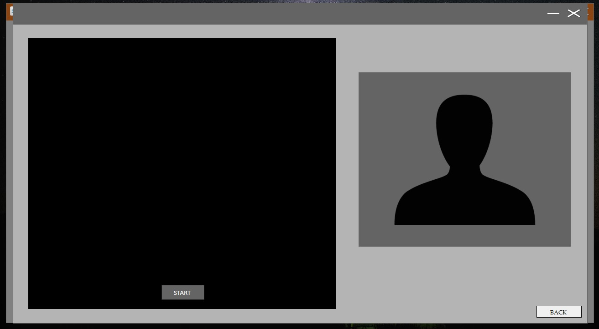

# STUDENT GATE ACCESS SYSTEM (with RFID and SMS Notification)

* Purpose: My CS-18 Thesis
* Programming Language: Visual Basic.Net
* Target Framework: .Net Framework 4.6.1
* IDE: MS Visual Studio 2012
* Backend Database: MySQL
* MySQL GUI Tool: MySQL Workbench
* Type of Application: Desktop Application (Windows Forms Application)  
* Printing Report: SAP Crystal Report
* Hashing Function: Bcrypt
* Required Hardwares:  
	-Network Broadband Stick (Any Network Broadband with SIM card and load)  
	-RFID Reader and Smart Cards Tag  

<h2> Hardwares I've used </h2> 
  
  
<h2> User Interface Screenshots </h2> 
  
  
  
  
  
  
  
  
  
	
  
	  
  
				  
  
  
  
  
  
  
  
	
  
	  
  
				  
  
    
<h2> Database Design from the scratch </h2> 
  
	
<h2> Database Design in MySQL Workbench </h2> 
  

<h2> Accounts that already created </h2>  

-Username: JCM  
-Password: JCM  
-Secret Question: What is your favorite color?  
-Secret Answer: JCM  

-Username: QWE  
-Password: QWE  
-Secret Question: What is love for you?  
-Secret Answer: QWE  
  
  